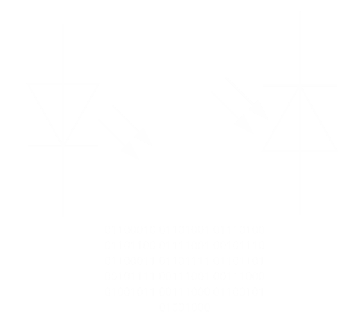

<!-- PROJECT LOGO -->
 

  

<h3 align="center">SLiWTP</h3>

  

    Simple Light-based Wireless Transmission Protocol     (One-way visible-light UART with esp32 build for educational purposes)
     

  

 
 
 

## About The Project

This project is an implementation of simple one-way UART protocol using blinking LED as the physical transmitting medium. For simplicity, both the transmitter and receiver are realized on one signle esp32 board. However in the code, those parts are clearly separated, so one could easily set up a scenario with two boards. 

The code is written and flashed using ArduinoIDE for its simplicity. In real use scenario, it would be probably better to run the program on esp32 without RTOS so that you could achieve faster and more reliable transmisison. The transmission achieved with this setup was more reliable than expected, but due to both transmitter and receiver being on one board and the fact that there is lot more instructions being executed in background than neccessary, the transmission speed was about 15 Bps.

Apart from the photodiode itself, I also added a blue optic filter (taken from paper 3D glasses) to minimize noise. It is however obvious, that noise is still a huge problem as you can never get fully rid of it except in total darkness (or at least absence of that one specific wavelength). 

The light source used in this example is classic blue LED diode, so the transmission distance has to be very short. However lasers could be for example used to optimize this transmission method.

 

(<a href="#readme-top">back to top</a>)

### Requirements

* Esp32 (or similar dev board)
* Breadboard
* LED
* photodiode (LED can be used)
* 330 and 100k resistor
* (optic filter of same color as the LED)

(<a href="#readme-top">back to top</a>)

### Protocol

On the board startup, there is a simple calibration process where the led blinks and the board measures the difference in light intensity between the HIGH and LOW state. The threshold for logical 1 is then defined as the average of those two values.

The board then waits for user input from serial line. When a byte is received (in case of strings, the serial input acts as a queue), the transmitter sends logical 1 as a start signal for transmitting one byte and then continues to represent each of the byte's bit as a HIGH or LOW state of the LED. The delay between each bit is predefined - just like in UART. 

The receiver function is easy - it just reads values and determines whether they are logical 1 or 0. If a 1 is found, it reads the following 8 bits to then send it back to serial line as a char.
 
 

## Relation to current wireless technologies

It is helpful to realize, that even though this method of transmitting data does indeed use electromagnetic radiation, it does so in a completely different way from known wireless technologies as WiFi or cellular. 

Those technologies use modulations like Phase-shift keying etc. meaning they modify the carrier electromagnetic wave itself to transmit data.

What my device does is just blinking LED = using millions of electromagnetic waves (photons) to indicate a logical 1 and (ideally) no waves to indicate logical 0. Frequency of light is much higher than WiFi or any other transmission technology and is not used for this purpose for multiple reasons, one of which is for example the difficulty of modulation of such a high frequency signal.

Even though IR exists, it is actually more similar to my protocol than the one WiFi, etc. uses.

## Example of transmission

<video width="100%" controls>
  <source src="assets/vidSerial.mp4" type="video/mp4">
</video>
<video width="100%" controls>
  <source src="assets/vidLed.mp4" type="video/mp4">
</video>

<!-- LICENSE -->
## License

Distributed under the MIT License. See `LICENSE.txt` for more information.

(<a href="#readme-top">back to top</a>)

